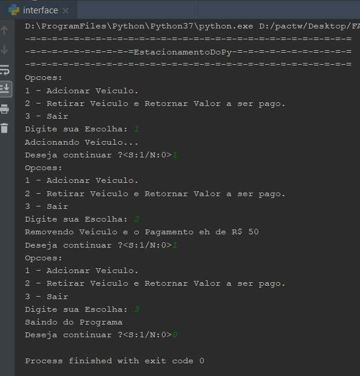
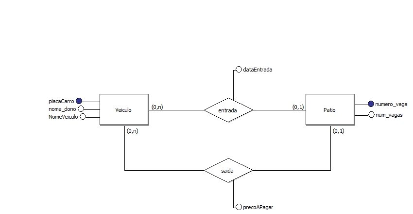

<h1>EstacionamentoDoPy</h1>
Trabalho do Professor Louzada sobre desenvolvimento Ágil que envolve a contrução de um sistema para um dono de Estacionamento
controlar a Entrada e Saída de Veículos e o pagamento que eles devem pelo horário usado.

<h4> Demonstração de Interface</h4>

 

<h4>Caso de Uso do Problema</h4>
 
 

<h4> Modelo entidade-relacionamento (MER)</h4>

 

